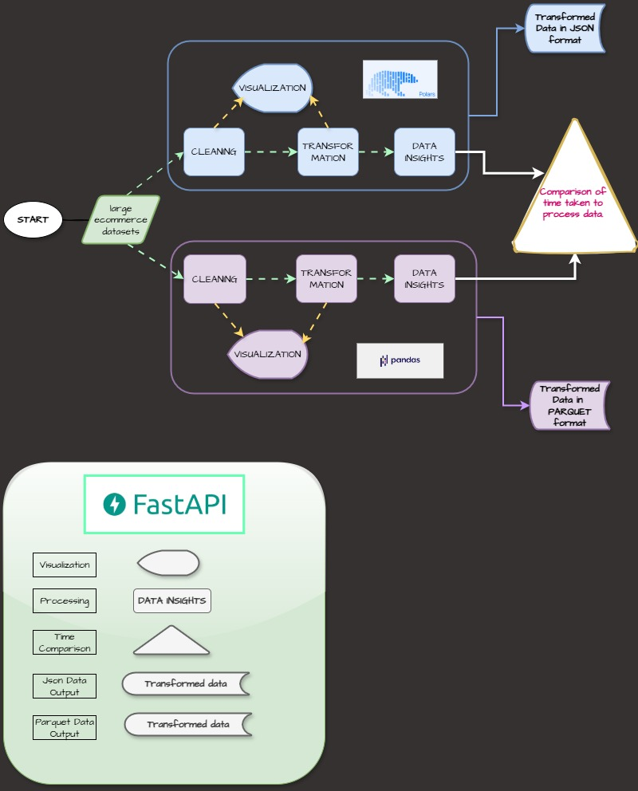
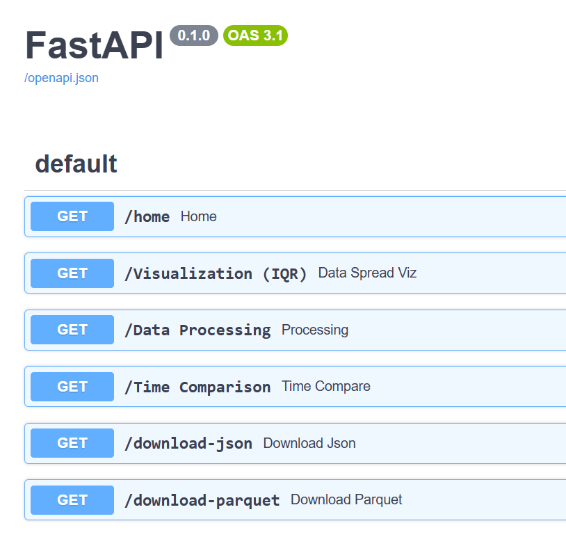
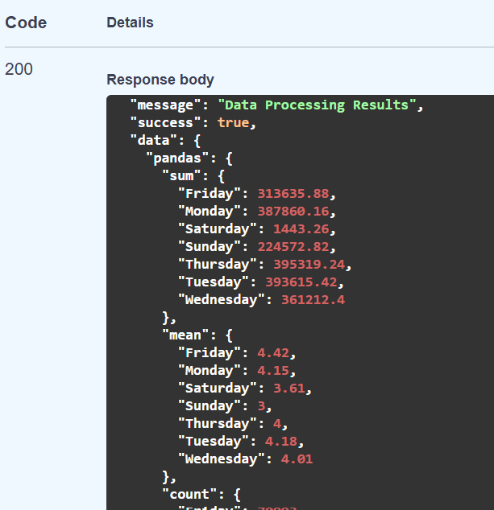
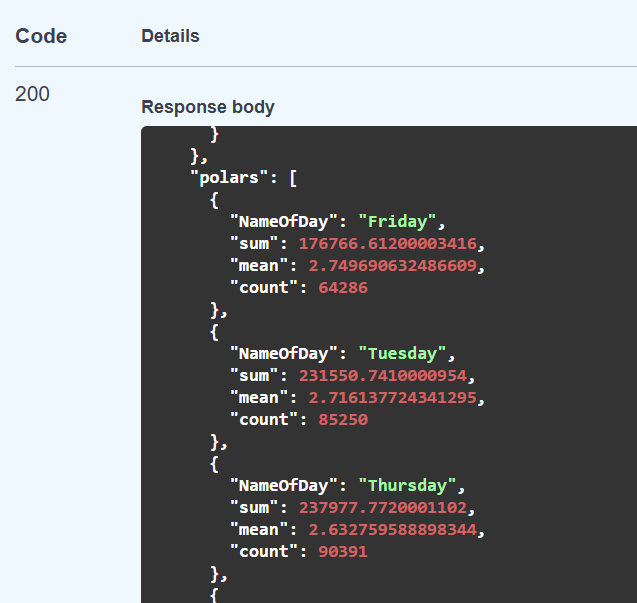
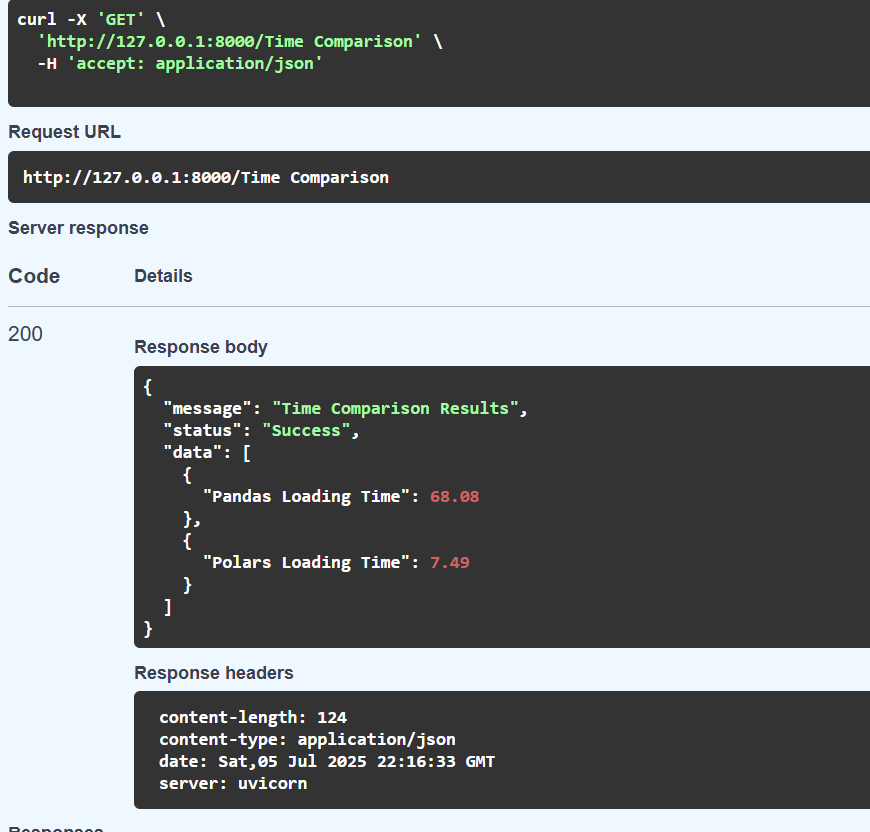

# **Project: Data Processing API**

## Goal:
The goal of this project is to build FastAPI-based web service that processes large datasets using **Polars** and **Pandas**,
and comparison of the two packages performance in loading, cleaning and transforming large datasets are reviewed.
The API is tested via an interactive `/docs` interface to reveal results of the comparison project. 

The service should:
- Load, clean, and aggregate data.
- Expose a FastAPI endpoint to return processed results.
- Write results to a JSON or Parquet file.

## **Project Structure**
```
data_processing_api/
    ├── .gitignore
    ├── README.md
    ├── main.py
    ├── pyproject.toml
    ├── poetry.lock
    ├── pictures/
    │   ├── flowcharts
    │   ├── api_endpoints results
    ├── data/
    │   ├── online_retail_ii.xlsx
    │   ├── transformed_data.json
    │   ├── transformed_data.parquet 
    ├── processor/
    |   ├── utils/
    |   |   ├── __init__.py
    |   |   ├── logger.py
    |   |   ├── utils.py
    │   ├── __init__.py
    │   ├── url_load.py
    │   ├── load_data.py
    │   ├── clean.py
    │   ├── aggregate.py
    └── tests/
        ├── __init__.py
        └── test_processor.py
```

### PROJECT MAP


### **FEATURES**
1. **FastAPI Endpoint**: A POST endpoint that loads, cleans, and aggregates dataset information.
2. **Dependency Management**: Use Poetry for package management.
3. **Virtual Environment**: Use `venv` for isolated Python environments.
4. **Data Processing**: Efficiently handle large datasets with **Polars** and **Pandas**.
5. **Data Cleaning**: Handle missing values, outliers, and incorrect formatting.
6. **File Handling**: Save processed results in JSON and Parquet formats.
7. **API Documentation**: Use Swagger UI (`/docs`) for interactive testing.

### **Set Up Environment**
1. Initialize a Python project using **Poetry**.
 - `cd path` Move to the main directory you want to use for the project.
 - `poetry new data-processing-api --name processor` This creates the project folder. 
 - `poetry env use python(version)` This chooses the python version you want to use and also automatically creates a virtual environment for you.
 - `poetry add package1 package2` Add main dependencies using this. 
 - `poetry add group --vizs package1 package2` Use this to add visualization dependencies.


### **Clone Repository**
```Clone the repository using 
git clone https://github.com/Iyanuvicky22/Projects.git
```


### **Run Project**
```
From the terminal run `poetry run fastapi dev main.py
```

### **FastAPI EndPoints**
```
GET/home "Welcome Message"
GET/Visualization (IQR) "Data Spread Visualizations"
GET/Data Processing "Data Processing"
GET/Time Comparison "Time Comparison"
GET/download-json "Download Json"
GET/download-parquet "Download Parquet"
```


## Example Results
Pandas


Polars


Time Comparison


## Dependencies
#### Main Dependencies
`fastapi` (>=0.115.8,<0.116.0),
`polars` (>=1.23.0,<2.0.0),
`pandas` (>=2.2.3,<3.0.0),
`openpyxl` (>=3.1.5,<4.0.0),
`requests` (>=2.32.3,<3.0.0),
`fastexcel` (>=0.14.0,<0.15.0),
`nbformat` (>=4.2.0)

#### Visualization Dependencies
[tool.poetry.group.vizs.dependencies]
`matplotlib` = "^3.10.1"
`seaborn` = "^0.13.2"
`plotly` = "^6.0.0"

#### Code Formating Dependency
[tool.poetry.group.dev.dependencies]
`black` = "^25.1.0"
`pytest-cov` = "^6.1.1"

### Author Arowosegbe Victor Iyanuoluwa
